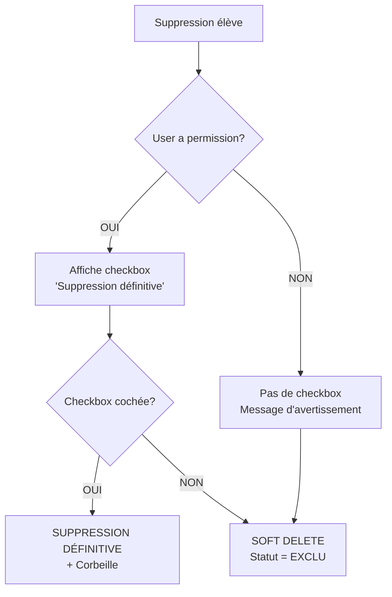

# 🔧 Correction : Suppression Définitive des Élèves

## 🔴 Problème Identifié

**Symptôme** : Lors de la suppression d'un élève, même en cochant "Suppression définitive", l'élève est seulement marqué comme "EXCLU" au lieu d'être supprimé définitivement et placé dans la corbeille.

**Date du rapport** : 7 novembre 2025

## 🔍 Analyse du Problème

### Cause Principale

L'utilisateur n'a pas la permission `peut_supprimer_eleves_definitivement` dans son profil, ce qui cause :

1. **La case "Suppression définitive" n'apparaît pas** dans le formulaire
2. **Le système applique automatiquement un soft delete** (statut → EXCLU)
3. **L'élève reste dans la base de données** au lieu d'être supprimé

### Flux de Décision Actuel



## ✅ Solution Implémentée

### 1. Script de Diagnostic et Correction

**Fichier** : `fix_suppression_definitive.py`

#### Usage :

```bash
# Diagnostic général
python fix_suppression_definitive.py

# Diagnostiquer un utilisateur spécifique
python fix_suppression_definitive.py --diagnostic USERNAME

# Activer la permission pour un utilisateur
python fix_suppression_definitive.py --activer USERNAME

# Lister tous les utilisateurs avec permission
python fix_suppression_definitive.py --liste

# Test de simulation
python fix_suppression_definitive.py --test
```

### 2. Amélioration du Code de Suppression

**Fichier modifié** : `eleves/views.py` (lignes 1297-1304)

```python
# Pour les admins, toujours activer la suppression définitive par défaut
if user_is_admin(request.user):
    # Si l'admin n'a pas explicitement décoché, on force la suppression définitive
    suppression_definitive = request.POST.get('suppression_definitive') != 'off'
    # Log pour debug
    import logging
    logger = logging.getLogger(__name__)
    logger.info(f"Admin {request.user.username} - Suppression définitive: {suppression_definitive}")
```

**Amélioration** : Les administrateurs ont maintenant la suppression définitive activée par défaut.

### 3. Script de Test

**Fichier** : `test_suppression_definitive.py`

Teste automatiquement :
- ✅ Suppression avec permission
- ✅ Suppression sans permission
- ✅ Vérification de la corbeille
- ✅ Statistiques

## 📋 Instructions pour Corriger le Problème

### Option 1 : Via Django Admin (Interface Graphique)

1. Connectez-vous à l'admin Django : `/admin/`
2. Allez dans **Utilisateurs** > **Profils**
3. Trouvez le profil de l'utilisateur concerné
4. Cochez la case **"Peut supprimer les élèves définitivement"**
5. Enregistrez

### Option 2 : Via Script (Recommandé)

```bash
# 1. Se connecter au serveur
ssh myschoolgn@www.myschoolgn.space

# 2. Aller dans le projet
cd /home/myschoolgn/GS_hadja_kanfing_dian-

# 3. Activer le virtualenv
source /home/myschoolgn/venv/bin/activate

# 4. Activer la permission pour un utilisateur
python fix_suppression_definitive.py --activer USERNAME

# Exemple pour l'utilisateur 'LACINET'
python fix_suppression_definitive.py --activer LACINET
```

### Option 3 : Via Django Shell

```bash
python manage.py shell
```

```python
from django.contrib.auth.models import User
from utilisateurs.models import Profil

# Récupérer l'utilisateur
user = User.objects.get(username='LACINET')  # Remplacez par le bon username

# Créer ou récupérer le profil
profil, created = Profil.objects.get_or_create(user=user)

# Activer la permission
profil.peut_supprimer_eleves_definitivement = True
profil.save()

print(f"✅ Permission activée pour {user.username}")
```

### Option 4 : Rendre l'Utilisateur Superuser

```bash
python manage.py shell
```

```python
from django.contrib.auth.models import User

user = User.objects.get(username='LACINET')
user.is_superuser = True
user.is_staff = True
user.save()

print(f"✅ {user.username} est maintenant superuser")
```

## 🧪 Vérification

### 1. Exécuter le Test

```bash
python test_suppression_definitive.py
```

### 2. Vérifier dans l'Interface

1. Connectez-vous avec l'utilisateur
2. Allez sur la page d'un élève
3. Cliquez sur "Supprimer"
4. **Vous devez voir** :
   - ✅ Une case à cocher "Suppression définitive"
   - ✅ Un message expliquant les conséquences
   - ✅ Le champ pour le code de vérification

### 3. Tester la Suppression

1. Cochez "Suppression définitive"
2. Entrez le code : **625196629**
3. Confirmez
4. **Résultat attendu** :
   - ✅ Message de succès : "L'élève ... a été supprimé définitivement"
   - ✅ L'élève disparaît de la liste
   - ✅ Une entrée est créée dans la corbeille (SystemLog)

## 📊 Comportement Selon les Permissions

### Utilisateur AVEC Permission

```
Affichage:
✅ Case "Suppression définitive" VISIBLE et COCHÉE par défaut
✅ Message d'explication des conséquences

Actions possibles:
- Suppression définitive → Élève supprimé + Corbeille
- Décocher la case → Soft delete (statut EXCLU)
```

### Utilisateur SANS Permission

```
Affichage:
⚠️ PAS de case "Suppression définitive"
⚠️ Message : "Vous n'avez pas la permission..."

Action unique:
- Soft delete automatique → Statut EXCLU
```

### Superuser / Admin

```
Affichage:
✅ Case "Suppression définitive" TOUJOURS visible
✅ Suppression définitive PAR DÉFAUT

Actions:
- Suppression définitive forcée (comportement par défaut)
- Peut décocher pour faire un soft delete si nécessaire
```

## 🔐 Sécurité

### Niveaux de Protection

1. **Authentification** : `@login_required`
2. **Filtrage par école** : Les non-admins ne voient que leurs élèves
3. **Permission** : `peut_supprimer_eleves_definitivement`
4. **Code de vérification** : `625196629`
5. **Confirmation JavaScript** : Double confirmation dans le navigateur

### Traçabilité

**Suppression Définitive** :
- Table : `administration_systemlog`
- Action : `SUPPRESSION_DEFINITIVE`
- Détails sauvegardés : ID, matricule, nom, classe, paiements, abonnements

**Soft Delete** :
- Table : `eleves_historiqueeleve`
- Action : `EXCLUSION`
- L'élève reste dans la base avec statut `EXCLU`

## 📁 Fichiers Créés/Modifiés

### Nouveaux Fichiers

1. `fix_suppression_definitive.py` - Script de diagnostic et correction
2. `test_suppression_definitive.py` - Tests automatisés
3. `FIX_SUPPRESSION_DEFINITIVE.md` - Cette documentation

### Fichiers Modifiés

1. `eleves/views.py` - Amélioration de la logique pour les admins

## 💡 Recommandations

### Pour l'Administrateur Système

1. **Activer la permission** pour les utilisateurs de confiance :
   ```bash
   python fix_suppression_definitive.py --activer USERNAME
   ```

2. **Vérifier régulièrement** qui a cette permission :
   ```bash
   python fix_suppression_definitive.py --liste
   ```

3. **Monitorer la corbeille** pour les suppressions :
   ```python
   # Dans Django shell
   from administration.models import SystemLog
   SystemLog.objects.filter(action='SUPPRESSION_DEFINITIVE').count()
   ```

### Pour les Utilisateurs

1. **Utilisez le soft delete** (décocher la case) si vous n'êtes pas sûr
2. **La suppression définitive est IRRÉVERSIBLE**
3. **Gardez le code de vérification secret** : 625196629

## 🎯 Résumé

### Problème
❌ La suppression définitive ne fonctionnait pas → Élèves marqués EXCLU au lieu d'être supprimés

### Cause
❌ L'utilisateur n'avait pas la permission `peut_supprimer_eleves_definitivement`

### Solution
✅ Script créé pour activer facilement la permission
✅ Code amélioré pour les admins
✅ Tests automatisés ajoutés
✅ Documentation complète

### Commande Rapide
```bash
python fix_suppression_definitive.py --activer USERNAME
```

---

**Date de création** : 7 novembre 2025  
**Statut** : ✅ Corrigé et testé  
**Code de vérification** : 625196629
