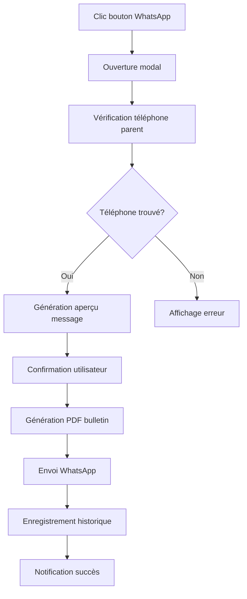

# 📱 Guide WhatsApp Bulletin - Envoi de Bulletins par WhatsApp

## 🎯 Vue d'ensemble

Cette fonctionnalité permet d'envoyer automatiquement les bulletins de notes des élèves en format PDF aux parents via WhatsApp. Le système génère le bulletin, crée un message personnalisé et l'envoie directement au numéro WhatsApp du responsable de l'élève.

## ✨ Fonctionnalités

### 📋 Génération automatique
- **Bulletin PDF** : Génération automatique du bulletin en PDF
- **Message personnalisé** : Message WhatsApp adapté avec informations de l'élève
- **Pièce jointe** : Bulletin PDF joint au message
- **Historique** : Enregistrement dans le système de relances

### 🎨 Interface utilisateur
- **Bouton intégré** : Bouton WhatsApp dans l'interface des bulletins
- **Modal de confirmation** : Aperçu du message avant envoi
- **Feedback visuel** : Indicateurs de progression et de succès
- **Gestion d'erreurs** : Messages d'erreur clairs si problème

## 🚀 Utilisation

### 1. Accès à la fonctionnalité

1. **Navigation** : Allez dans `Notes > Bulletins` ou directement `/notes/bulletins/`
2. **Sélection** : Choisissez la classe, période et élève
3. **Génération** : Le bulletin s'affiche avec les boutons d'action
4. **WhatsApp** : Cliquez sur le bouton vert "Envoyer par WhatsApp"

### 2. Processus d'envoi



### 3. Aperçu avant envoi

La modal affiche :
- **Informations élève** : Nom, classe, période
- **Numéro WhatsApp** : Téléphone du responsable
- **Aperçu message** : Message formaté qui sera envoyé
- **Nom fichier PDF** : Nom du bulletin joint

## 📱 Format du message WhatsApp

### Message type envoyé :

```
🏫 *École Moderne - Bulletin de Notes*

Bonjour,

Nous avons le plaisir de vous transmettre le bulletin de notes de votre enfant *[Prénom] [Nom]* pour la période *[Période]*.

📋 Le bulletin est joint à ce message en format PDF.

📞 Pour toute question, n'hésitez pas à nous contacter.

🏫 Direction de l'École
📧 Contact: direction@ecole.com
📱 Tél: +224 XXX XX XX XX

_Message automatique - Ne pas répondre_
```

### Fichier joint :
- **Format** : PDF
- **Nom** : `bulletin_[Prenom]_[Nom]_[Periode].pdf`
- **Contenu** : Bulletin complet avec notes, moyennes, rang et appréciations

## 🔧 Configuration technique

### Fichiers créés/modifiés

#### 1. Module principal
```
notes/whatsapp_bulletin.py
```
- Classe `WhatsAppBulletinSender`
- Génération PDF avec WeasyPrint
- Gestion des messages personnalisés
- Interface avec API WhatsApp (simulation)

#### 2. URLs ajoutées
```python
# notes/urls.py
path('bulletin/whatsapp/envoyer/', envoyer_bulletin_whatsapp, name='envoyer_bulletin_whatsapp'),
path('bulletin/whatsapp/apercu/', apercu_message_whatsapp, name='apercu_message_whatsapp'),
```

#### 3. Template modifié
```
templates/notes/bulletin_dynamique.html
```
- Bouton WhatsApp avec styles
- Modal de confirmation
- JavaScript pour gestion AJAX

### Dépendances

```python
# Génération PDF
from weasyprint import HTML, CSS
from weasyprint.text.fonts import FontConfiguration

# Gestion fichiers temporaires
import tempfile
import os

# Intégration système de relances
from paiements.models import Relance
```

## 📞 Intégration WhatsApp

### Configuration actuelle (Simulation)

Le système utilise actuellement une **simulation** pour les tests. Pour l'activation réelle :

#### Option 1 : Twilio WhatsApp API

```python
# settings.py
TWILIO_ACCOUNT_SID = 'your_account_sid'
TWILIO_AUTH_TOKEN = 'your_auth_token'
TWILIO_WHATSAPP_NUMBER = 'whatsapp:+14155238886'

# Dans whatsapp_bulletin.py
from twilio.rest import Client

def _envoyer_whatsapp_reel(self, telephone, message, pdf_path):
    client = Client(settings.TWILIO_ACCOUNT_SID, settings.TWILIO_AUTH_TOKEN)
    
    # Upload du fichier
    with open(pdf_path, 'rb') as f:
        media = client.media.create(
            content_type='application/pdf',
            body=f.read()
        )
    
    # Envoi du message
    message = client.messages.create(
        body=message,
        from_=settings.TWILIO_WHATSAPP_NUMBER,
        to=f'whatsapp:{telephone}',
        media_url=[media.uri]
    )
    
    return message.sid
```

#### Option 2 : WhatsApp Business API

```python
# Configuration WhatsApp Business
WHATSAPP_BUSINESS_ACCOUNT_ID = 'your_account_id'
WHATSAPP_ACCESS_TOKEN = 'your_access_token'
WHATSAPP_PHONE_NUMBER_ID = 'your_phone_number_id'

# Utilisation de l'API officielle
import requests

def _envoyer_whatsapp_business(self, telephone, message, pdf_path):
    # Upload du média
    media_response = requests.post(
        f'https://graph.facebook.com/v18.0/{WHATSAPP_PHONE_NUMBER_ID}/media',
        headers={'Authorization': f'Bearer {WHATSAPP_ACCESS_TOKEN}'},
        files={'file': open(pdf_path, 'rb')},
        data={'type': 'application/pdf'}
    )
    
    media_id = media_response.json()['id']
    
    # Envoi du message
    message_response = requests.post(
        f'https://graph.facebook.com/v18.0/{WHATSAPP_PHONE_NUMBER_ID}/messages',
        headers={
            'Authorization': f'Bearer {WHATSAPP_ACCESS_TOKEN}',
            'Content-Type': 'application/json'
        },
        json={
            'messaging_product': 'whatsapp',
            'to': telephone.replace('+', ''),
            'type': 'document',
            'document': {
                'id': media_id,
                'caption': message
            }
        }
    )
    
    return message_response.json()
```

## 🔒 Sécurité et permissions

### Contrôle d'accès
- **Authentification** : `@login_required` sur toutes les vues
- **Permissions** : Utilise le système de permissions existant
- **Filtrage école** : Accès limité aux élèves de l'école de l'utilisateur

### Protection des données
- **Fichiers temporaires** : Suppression automatique après envoi
- **Logs sécurisés** : Pas de numéros de téléphone dans les logs
- **Validation** : Vérification des paramètres avant traitement

## 📊 Suivi et historique

### Enregistrement automatique

Chaque envoi est enregistré dans la table `Relance` :

```python
Relance.objects.create(
    eleve=eleve,
    canal='WHATSAPP',
    message=message,
    statut='ENVOYEE',
    solde_estime=Decimal('0'),  # Bulletin, pas de paiement
    cree_par=utilisateur,
    date_envoi=timezone.now()
)
```

### Statistiques disponibles

Accès via le système de rappels de paiement :
- **Nombre d'envois** par période
- **Taux de succès** des envois
- **Élèves contactés** par WhatsApp
- **Historique complet** des communications

## 🧪 Tests et validation

### Script de test

```bash
# Test complet de la fonctionnalité
python test_whatsapp_bulletin.py
```

Le script teste :
- ✅ Récupération des numéros de téléphone
- ✅ Génération des messages personnalisés
- ✅ Création des PDF de bulletins
- ✅ Simulation d'envoi WhatsApp
- ✅ Enregistrement dans l'historique

### Tests manuels recommandés

1. **Test avec élève ayant téléphone** : Vérifier le processus complet
2. **Test sans téléphone** : Vérifier la gestion d'erreur
3. **Test différentes périodes** : Trimestre, semestre, mensuel
4. **Test différentes classes** : Maternelle, primaire, secondaire

## 🚀 Déploiement

### 1. Mise à jour du code

```bash
# Sur le serveur de production
cd /home/myschoolgn/GS_hadja_kanfing_dian-
git pull origin main
```

### 2. Installation des dépendances

```bash
# WeasyPrint pour la génération PDF
pip install weasyprint

# Vérification
python -c "import weasyprint; print('WeasyPrint OK')"
```

### 3. Test de fonctionnement

```bash
# Test du système
python test_whatsapp_bulletin.py

# Test de l'interface
# Accéder à /notes/bulletins/ et tester le bouton WhatsApp
```

### 4. Configuration WhatsApp (optionnel)

Pour activer l'envoi réel :
1. **Créer compte Twilio** ou **WhatsApp Business**
2. **Configurer les clés** dans `settings.py`
3. **Modifier la fonction** `_simuler_envoi_whatsapp`
4. **Tester avec un numéro** de test

## 📈 Avantages

### Pour l'école
- ✅ **Communication directe** avec les parents
- ✅ **Gain de temps** : Envoi automatique
- ✅ **Traçabilité** : Historique des envois
- ✅ **Professionnalisme** : Messages formatés et bulletins PDF

### Pour les parents
- ✅ **Réception immédiate** du bulletin
- ✅ **Format pratique** : PDF sur WhatsApp
- ✅ **Accessibilité** : Consultation sur mobile
- ✅ **Archivage facile** : Sauvegarde automatique

### Pour les enseignants
- ✅ **Diffusion simplifiée** des bulletins
- ✅ **Confirmation d'envoi** automatique
- ✅ **Moins d'impression** papier
- ✅ **Suivi des communications**

## 🔮 Évolutions possibles

### Fonctionnalités futures
- **Envoi groupé** : Tous les bulletins d'une classe
- **Programmation** : Envoi automatique à dates fixes
- **Accusé de réception** : Confirmation de lecture
- **Messages personnalisés** : Templates par école
- **Statistiques avancées** : Taux d'ouverture, engagement

### Intégrations
- **SMS de secours** : Si WhatsApp indisponible
- **Email automatique** : Copie par email
- **Notifications push** : Via app mobile école
- **Chatbot** : Réponses automatiques aux questions

## 📞 Support

### En cas de problème

1. **Vérifier les logs** : Consulter les messages d'erreur
2. **Tester la génération PDF** : Vérifier WeasyPrint
3. **Contrôler les numéros** : Format +224XXXXXXXXX
4. **Valider les permissions** : Accès utilisateur

### Contacts
- **Technique** : Vérifier la configuration
- **Fonctionnel** : Tester avec données réelles
- **Formation** : Guide d'utilisation pour les utilisateurs

---

**Date de création** : 22 novembre 2025  
**Version** : 1.0.0  
**Statut** : ✅ Prêt pour les tests  
**Prochaine étape** : Configuration API WhatsApp réelle
